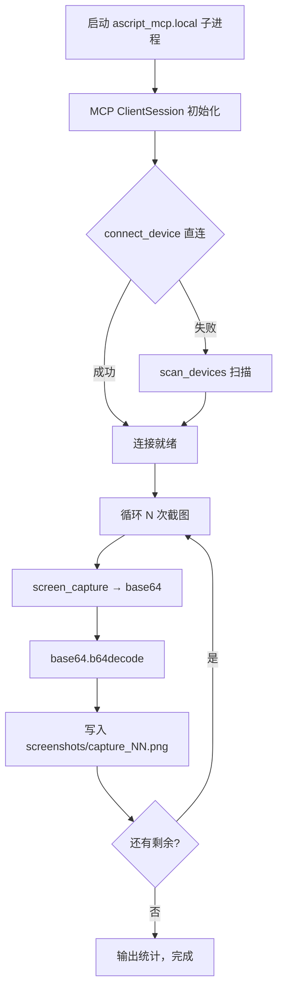

## 用户需求

在 test2 同级新建 `test3/` 文件夹，实现最简化的 PC 控制手机截图管线：

- PC 通过 AScript MCP 协议连接手机（WiFi 局域网，端口 9096）
- 调用 `screen_capture` 工具截图，获取 base64 图片数据
- 解码后保存到 PC 本地 `test3/screenshots/` 目录
- 支持设备 IP 自动扫描发现（DHCP 导致 IP 变化时无需手动改配置）

## 核心功能

- **设备连接**：先尝试指定 IP 直连，失败自动 `scan_devices` 扫描发现
- **截图循环**：连续截图 N 张（默认 5 张），可配置间隔和张数
- **本地保存**：截图以 `capture_01.png` 等序号命名，保存到 `screenshots/` 目录
- **一键启动**：Windows 批处理 `run.bat`，使用 conda 环境

## 不做的事情

- 不涉及搜索、UI 树分析、提取作者 ID 等业务逻辑
- 不部署代码到手机（`deploy_and_run`），纯 PC 端控制
- 不引入快手 App 相关的导航操作

## 技术栈

- **语言**：Python 3（asyncio 异步模式）
- **MCP 客户端**：`mcp.ClientSession` + `mcp.client.stdio.stdio_client`
- **AScript 服务端**：`python -m ascript_mcp.local`（StdioServerParameters 子进程启动）
- **截图工具**：`session.call_tool("screen_capture", {})` 返回 base64
- **设备发现**：`connect_device`（直连）+ `scan_devices`（自动扫描兜底）
- **运行环境**：Windows + conda 环境 `zscq`（已预装 `ascript_mcp`、`mcp` 等依赖）
- **编码**：`sys.stdout.reconfigure(encoding='gbk')` 兼容 Windows cmd 中文输出

## 实现方案

### 整体策略

从 `test1/main.py` 中提取核心截图管线，剥离快手业务逻辑（搜索、点击、UI树分析），只保留 MCP 连接 + `screen_capture` + 本地保存三段式。代码量控制在约 80 行，单文件即可。

### 核心流程



### 关键设计决策

1. **直接复用 test1/main.py 的捕获模式**：`capture_burst()` 函数（第 144-155 行）已经验证可行，直接抽取其逻辑
2. **简化参数入口**：不使用任务菜单模式，改为简单的命令行参数：`python main.py [张数] [间隔秒]`
3. **自动创建目录**：`os.makedirs(SCREENSHOT_DIR, exist_ok=True)`
4. **时间戳文件名替代序号**：使用 `%Y%m%d_%H%M%S` 格式避免重名覆盖
5. **无参数时默认 5 张，0.8 秒间隔**：合理的默认值，快速测试用

### 实现细节（防踩坑）

- **MCP 子进程管理**：使用 `async with stdio_client(sp)` 上下文管理器，确保进程退出时自动清理
- **设备扫描超时**：`scan_devices` 需要 3-5 秒，日志中提示等待
- **base64 数据提取**：`item.type == "image"` 时取 `item.data`，过滤 `"text"` 类型的日志内容
- **GBK 编码**：参考 test1/main.py 的 `sys.stdout.reconfigure(encoding='gbk')` 处理 Windows 终端中文
- **错误容错**：单张截图失败打印警告继续，不中断整个循环

## 目录结构

```
test3/
├── main.py          # [NEW] 唯一核心文件：MCP连接→扫描设备→循环截图→保存本地
├── run.bat          # [NEW] Windows 一键启动：conda run -n zscq python main.py %*
└── screenshots/     # [AUTO] 截图输出目录，程序自动创建
```

### 文件说明

- **main.py**：单文件约 80 行。导入 `asyncio/base64/os/sys/re`，定义 `run()` 异步主函数：初始化 MCP Session → 连接设备（直连+扫描兜底）→ 解析命令行参数（张数/间隔）→ 循环 `screen_capture` → 解码写入 PNG → 输出统计。`if __name__ == "__main__"` 入口调用 `asyncio.run(run())`。
- **run.bat**：`@echo off` + `conda run -n zscq python "%~dp0main.py" %*`，双击即可运行，支持传参。