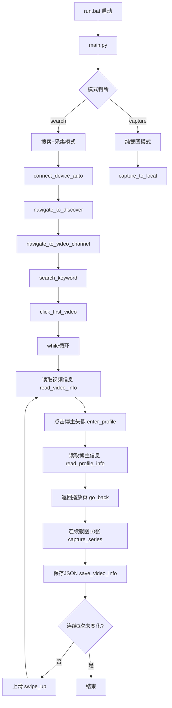

## 用户需求

在 `d:/code/vscodeWorkDir/zscqNew/` 下新建 `weixin` 文件夹，构建一套微信视频号自动化取证管线，功能对标 test3 的快手采集系统。

## 产品概述

一个基于 AScript MCP 的微信视频号数据自动采集工具，通过 PC 远程控制 Android 手机，实现对微信视频号的搜索、视频信息采集、截图和结构化 JSON 数据导出，用于批量取证场景。

## 核心功能

- **设备连接**：自动连接手机（172.16.1.216:9096），支持直连和扫描发现两种方式
- **微信视频号导航**：从微信首页逐层导航进入视频号页面（首页 → 发现 → 视频号）
- **关键词搜索**：在视频号内搜索指定关键词，定位搜索结果
- **视频信息采集**：进入视频播放页后读取博主名、快手号、发布时间、播放量、点赞数、评论数、收藏数、分享数等字段
- **博主主页采集**：进入博主主页读取博主名称和账号信息
- **批量截图**：每个视频返回播放页后连续截图 10 张，按关键词和博主名命名
- **JSON 数据导出**：每个视频的信息以 JSON 格式追加保存，按关键词分子目录存储
- **循环采集**：上滑切换视频，连续采集直至连续 3 次博主名无变化时自动停止
- **纯截图模式**：支持不带搜索流程的纯截图功能
- **单步测试**：提供各环节的独立测试脚本，便于 UI 定位调试

## 技术栈

- **语言**：Python 3
- **通信协议**：MCP (Mobile Control Protocol)，通过 `ascript_mcp.local` 服务端
- **手机端操作**：`deploy_and_run` 远程执行 Python 脚本，使用 `ascript.android.action` 和 `Selector`
- **UI 探索**：`dump_ui_tree` 获取 Android 界面控件树，JSON 解析
- **截图**：`screen_capture` 获取 base64 编码图片
- **运行环境**：conda 环境 `zscq`，Windows 系统

## 实现方案

### 整体策略

以 test3 的架构为蓝本，复用全部 MCP 辅助函数（`run_on_phone`、`get_ui_tree`、`walk_ui`、`find_visible_by_id`、`find_tabs_container` 等），重新实现与微信视频号适配的操作流程。微信与快手最大的差异在于：

1. 入口方式不同（导航代替 Activity 启动）
2. UI 控件 ID 不同（需通过 dump_ui_tree 探索后逐步确定）
3. 返回机制可能不同（快手固定坐标 (109,212)，微信需重新定位）

### 架构设计



### 关键设计决策

1. **导航替代直接启动**：微信视频号没有独立的启动 Activity（不像快手 `com.kuaishou.nebula/com.yxcorp.gifshow.HomeActivity`），微信的包名为 `com.tencent.mm`，需通过 UI 导航逐层进入：启动微信 → 点击"发现"Tab → 点击"视频号"入口。这意味着导航阶段需要依赖 `dump_ui_tree` 定位元素 + `deploy_and_run` 点击。

2. **UI 定位兜底策略**：所有 UI 操作沿用 test3 的"UI 树定位 + 兜底坐标"双保险模式。初始阶段兜底坐标先用占位值，待实际 dump 后校准。

3. **代码复用最大化**：将 test3 中通用的 MCP 辅助函数、截图函数、JSON 保存函数、工具函数（`safe_filename`、`parse_count`、`ZERO_HINTS`）直接复用，仅重写微信视频号特有的操作流程函数。

4. **模块化拆分**：将微信视频号的操作流程拆分为独立函数（`navigate_to_discover`、`navigate_to_video_channel`、`search_keyword`、`click_first_video`、`read_video_info`、`enter_profile`、`read_profile_info`、`go_back`、`swipe_up`），便于后续单步调试和 UI 定位校准。

## 目录结构

```
d:/code/vscodeWorkDir/zscqNew/
├── test3/                          # 已有项目（快手采集）
│   └── ...
└── weixin/                         # [NEW] 新建文件夹
    ├── main.py                     # [NEW] 主入口。复用 test3 的 MCP 辅助函数和工具函数，实现微信视频号完整采集管线：
    │                               #   - 通用函数：run_on_phone, get_ui_tree, walk_ui, find_visible_by_id, 
    │                               #     find_tabs_container, get_clickable_children_by_parent, safe_filename,
    │                               #     parse_count, ZERO_HINTS, connect_device_auto
    │                               #   - 微信导航：navigate_to_discover（首页→发现）, 
    │                               #     navigate_to_video_channel（发现→视频号）
    │                               #   - 搜索流程：search_keyword（找搜索入口→点击→输入→触发搜索）
    │                               #   - 视频操作：click_first_video（定位并点击第一个视频卡片）
    │                               #   - 信息采集：read_video_info（读取播放页7个字段）,
    │                               #     enter_profile（点击博主头像进入主页）,
    │                               #     read_profile_info（读取博主名称和账号）
    │                               #   - 导航操作：go_back（返回播放页）, swipe_up（上滑下一个视频）
    │                               #   - 截图：capture_to_local, capture_series
    │                               #   - JSON：save_video_info
    │                               #   - 主流程：run() 函数，支持 search 和 capture 两种模式
    │                               #   - 配置：PHONE_IP="172.16.1.216", WECHAT_PACKAGE="com.tencent.mm"
    ├── run.bat                     # [NEW] 启动脚本。设置 UTF-8 编码，通过 conda run -n zscq 执行 main.py
    ├── step_tests/                 # [NEW] 单步测试脚本目录
    │   ├── test_navigate_discover.py     # [NEW] 测试：从微信首页导航到发现页
    │   ├── test_navigate_video_channel.py # [NEW] 测试：从发现页进入视频号
    │   ├── test_search.py                # [NEW] 测试：视频号内搜索关键词
    │   ├── test_click_first_video.py     # [NEW] 测试：点击第一个视频卡片
    │   ├── test_read_video_info.py       # [NEW] 测试：播放页读取视频信息和博主信息
    │   ├── test_back_button.py           # [NEW] 测试：定位并点击返回按钮
    │   ├── test_swipe_up.py              # [NEW] 测试：上滑切换视频
    │   └── test_dump_ui_tree.py          # [NEW] 测试：dump 当前页面 UI 树（调试用）
    ├── jsons/                      # [NEW] JSON 数据存储目录（按关键词自动创建子目录）
    └── screenshots/                # [NEW] 截图存储目录（按关键词自动创建子目录）
```

## 实现细节

### main.py 核心函数清单

**复用函数（与 test3 完全一致）**：

- `run_on_phone(session, code, log_sec)` — 通过 deploy_and_run 在手机端执行代码
- `get_ui_tree(session)` — 获取当前界面 UI 树
- `walk_ui(data, keyword, id_sub, clickable)` — 遍历 UI 树查找节点
- `find_visible_by_id(nodes, target_id, min_y, max_y)` — 按 id 子串查找可见范围内节点
- `find_tabs_container(data)` — 递归查找 Tab 栏容器
- `get_clickable_children_by_parent(node)` — 获取父节点下 clickable 子节点（按 x 排序）
- `safe_filename(text)` — 清理文件名非法字符
- `parse_count(text)` — 解析数字字段（处理零值提示语）
- `connect_device_auto(session)` — 自动连接设备
- `capture_to_local(session, count, interval, prefix)` — 纯截图
- `capture_series(session, keyword, blogger_name, screenshot_dir, count, interval)` — 连续截图系列
- `save_video_info(keyword, record)` — 保存 JSON
- 常量：`ZERO_HINTS`

**新增函数（微信视频号特有）**：

- `navigate_to_discover(session)` — 从微信首页点击底部"发现"Tab（UI定位+兜底坐标）
- `navigate_to_video_channel(session)` — 在发现页找"视频号"入口并点击进入
- `search_keyword(session, keyword)` — 视频号内搜索：找搜索入口→点击→输入→多策略触发搜索
- `click_first_video(session)` — 定位视频列表页第一个视频卡片并点击
- `read_video_info(session)` — 播放页读取博主名/时间/播放量/点赞/评论/收藏/分享
- `enter_profile(session)` — 点击博主头像进入主页
- `read_profile_info(session)` — 读取博主主页名称和账号
- `go_back(session)` — 返回上一页（UI定位左上角返回按钮）
- `swipe_up(session)` — 从底部向上滑动切换视频

### 关键差异：微信视频号 UI 定位策略

由于微信视频号的 UI 控件 ID 未知，所有定位函数采用以下策略：

1. **首次探索**：通过 `test_dump_ui_tree.py` 和单步测试脚本逐页 dump UI 树
2. **智能匹配**：每个定位函数优先通过 UI 树特征匹配（text 关键词、id 子串、clickable 属性、坐标范围）
3. **兜底坐标**：每个定位函数保留兜底固定坐标（初始用 NaN 占位，实际 dump 后填入）
4. **日志输出**：所有定位过程输出详细日志（找到的节点信息或兜底原因）

### 性能与可靠性

- **多策略搜索触发**：沿用 test3 的 Selector + 键盘坐标兜底策略
- **页面切换等待**：每次操作后 `asyncio.sleep` 1-2 秒等待页面加载
- **连续 3 次无变化停止**：避免无限循环，上滑 3 次后博主名不变则终止
- **JSON 追加模式**：支持断点续采，程序中断后重新运行可继续追加数据
- **错误容错**：每个 UI 定位都有兜底策略，采集字段未找到标记 `[未找到]` 而非崩溃

## Agent Extensions

### SubAgent

- **code-explorer**
- 目的：在实施过程中需要参考 test3 的完整代码结构和具体函数实现，code-explorer 可快速定位和提取所需的关键代码片段
- 预期结果：获取 test3/main.py 中所有可复用函数的精确代码，确保 weixin/main.py 的正确实现